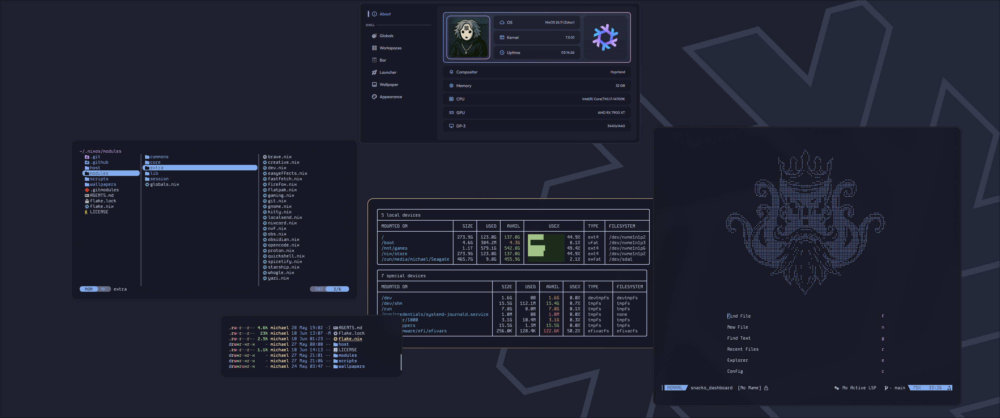

# goon/nixos 

<div align="center">

<br></br>


[](/LICENSE)


<p align="center"></p>
</div>

Another **blazingly mid** nix configuration with an overengineered dendritic architecture built on **flakes** and **home manager** with automatic module discovery, powered by **Hyprland**, and held together by hopes, dreams and vibes.

> [!IMPORTANT]
> This is a **personal** configuration, shared for reference and inspiration **NOT** adoption. 
>
> - This configuration is constantly evolving. It is prone to drastic and likely **breaking** changes.
> - Features may be partially implemented or entirely broken.
> - The README and documentation will often times be outdated.
> - I provide **no guarantees** of stability or support.
>
> **If you intend to use any aspect of my configuration, make sure you:**
> 1. Review the code thoroughly.
> 2. Understand what each module does. 
> 3. Adapt it to your specific use case.

## Table of Contents

- [Screenshots](#screenshots)
- [Structure](#structure)
- [Modules](#modules)
- [Formatting](#formatting)
- [Deployment](#deployment)
- [Credits](#credits)
- [License](#license)

## Screenshots 

<div align="center">



</div>

## Structure 

- `flake.nix` & `flake.lock` — Define the entry points and locks dependencies. 
- `hosts/` —  Contains host specific configuration.
- `lib/` — Helper Scripts
- `modules/` — Contains nix and home manager modules.
- `scripts/` — Contains various `bash` scripts.
- `wallpapers/` — Collection of wallpapers for your viewing pleasure.

## Modules 

- `modules/commons` — Universal Configurations
- `modules/core` — Device & Hardware Configurations
- `modules/extra` — Software Configurations
- `modules/session` — Window Managers & Shell

### The Dendritic Module Engine


To heavily reduce boilerplate traditionally associated with mixing NixOS and Home Manager configurations a custom abstraction engine is used (`lib.module`). 

Instead of dealing with deeply nested `home-manager.sharedModules` arrays, every module is automatically exposed with three root level blocks:

```nix
{ config, lib, pkgs, ... }:

lib.module config "moduleName" true {
  # 1. System Layer
  config = {
    services.example.enable = true;
  };

  # 2. Package Injection
  userPkgs = with pkgs; [
    example-package
  ];

  # 3. User Layer
  home = {
    programs.example = {
      enable = true;
      settings = { ... };
    };
  };
}
```

The `config`, `home` and `userPkgs` blocks are automatically parsed and natively wired into NixOS and Home Manager under the hood, ensuring that modules remain flat, organised and stripped of boilerplate.

Every `.nix` file under `modules/` is automatically discovered and imported by `lib/recursive.nix`, preventing the need for manual imports. The importer skips private files prefixed with `_` or `.`. To disable / enable a feature or module on a given host, `module.<name>.enable = <true/false>;` can be set.

Hosts are formed by combining the auto discovered modules with host specific overrides in `hosts/<hostname>/default.nix`. Where the host file serves as a **dendritic dashboard** for enabling hardware support, selecting a window manager and documenting which modules are explicitly enabled or disabled.

## Formatting 

The code quality and formatting is enforced via [**treefmt-nix**](https://github.com/numtide/treefmt-nix), utilising three tools. 

- [`nixfmt`](https://github.com/NixOS/nixfmt) — The standard Nix formatter, ensuring consistent whitespace, line breaks and attribute ordering. 
- [`deadnix`](https://github.com/astro/deadnix) — Scans for unused `let` bindings, unreferenced function arguments and dead `with` statements.
- [`statix`](https://github.com/nerdypepper/statix) — Analyses expressions for anti-patterns e.g. unused `args`, unnecessary `with` statements and deprecated idioms.

The formatter module at `lib/formatter.nix` is passed through `treefmt-nix`'s `evalModule`, which outputs a combined wrapper binary. The wrapper runs all three tools in sequence.


## Deployment

> [!WARNING]
> The configuration expects the flake to live in `$HOME/.nixos`.
>
> Your username and the location of the flake can be modified inside of `hosts/vars.nix`.
>
>**Forgetting to update these values will result in a broken configuration.**


### Deployment Script 

1. **Clone**

   ```bash
   nix-shell -p git
   git clone --recursive https://github.com/goon/nixos ~/.nixos
   cd ~/.nixos

   ```

> [!NOTE]
> The `--recursive` flag ensures the `yaks` quickshell submodule is pulled.

2. **Run the Bootstrap Script**

   ```bash
   ./scripts/bootstrap

   ```

### Manual Deployment 

1. **Clone:** 

   ```bash
   nix-shell -p git
   git clone --recursive https://github.com/goon/nixos ~/.nixos
   cd ~/.nixos

   ```

> [!NOTE]
> The `--recursive` flag ensures the `yaks` quickshell submodule is pulled.

2. **Generate Hardware Configuration:**
   ```bash
   nixos-generate-config --show-hardware-config > hosts/desktop/hardware-configuration.nix
   ```

3. **Rebuild:**
   ```bash
   sudo nixos-rebuild switch --flake .#desktop 
   ```

4. **Update:**
   ```bash
   sudo nix flake update
   ```

## Credits

Thank you to the countless Nix OS configurations that I ~~copied~~ learnt from. 

namishh — seniormatt — hlissner — fufexan — frost-pheonix — anotherhadi — vic — vimjoyer — bad3r — mitchellh — misterio77 — max-baz — gvolpe — librephoenix — sioodmy

Due to my dementia I may have missed many. Regardless, I am thankful. 

## License 

This repository is licensed under the **[MIT LICENSE](/LICENSE)**. 

<p align="center"></p>